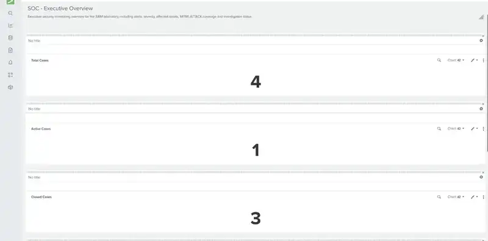
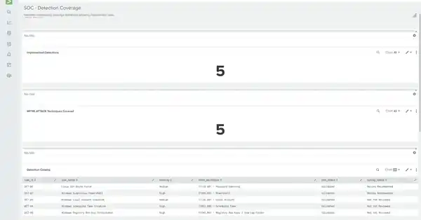

# SIEM SOC Lab

> **Hands-on SOC / detection-engineering portfolio project using Splunk Enterprise, Sysmon, Windows and Linux telemetry.**
>
> The lab demonstrates an end-to-end security-operations workflow: telemetry onboarding, detection engineering, alerting, case triage, investigation, MITRE ATT&CK mapping, incident closure, dashboards and evidence-based tuning.

## Portfolio snapshot

| Capability | Evidence in this repository |
| --- | --- |
| Detection engineering | 5 implemented and validated detections with reproducible SPL |
| MITRE ATT&CK | 5 mapped techniques across credential access, execution and persistence |
| SOC operations | Lookup-backed triage queue, ownership, notes, status and SLA tracking |
| Incident response | 2 fully documented investigations with evidence and final classification |
| Playbooks | 3 operational investigation playbooks |
| Detection tuning | 2 rules tuned with measured before/after validation |
| Dashboarding | 3 Splunk dashboards for executive, operational and detection coverage views |
| Windows telemetry | Sysmon process, network and persistence-oriented analysis |
| Linux telemetry | SSH authentication and audit analysis |

## Selected visual evidence

### Executive case visibility



The executive dashboard turns case state into operational metrics such as total, active and closed cases, priority distribution and detection-rule context.

### Detection engineering coverage



The detection-coverage dashboard shows the 5 implemented detections, 5 mapped ATT&CK techniques, validation maturity and data-source readiness.

More screenshots, including analyst triage and tuning regression evidence, are available in the [visual evidence gallery](screenshots/README.md).

## What this project demonstrates

This repository is intentionally structured to show practical, entry-level/junior SOC capability rather than only a finished dashboard.

- writing and validating SPL detection logic
- working with Sysmon and Linux authentication telemetry
- using Splunk CIM / data models
- mapping detections to MITRE ATT&CK
- building correlation keys and alert throttling
- triaging and assigning cases
- reconstructing process lineage
- decoding and analyzing PowerShell EncodedCommand payloads
- distinguishing True Positive, Benign Positive and unclassified cases
- measuring tuning impact before changing a production-style saved search
- documenting repeatable SOC playbooks and incident reports

## Quick navigation

### Detection engineering

- [Detection catalog](detections/detection-catalog.md)
- [DET-01 — Linux SSH Brute Force](detections/DET-01-Linux-SSH-Brute-Force.md)
- [DET-02 — Windows Suspicious PowerShell](detections/DET-02-Windows-Suspicious-PowerShell.md)
- [DET-03 — Windows Local Account Creation](detections/DET-03-Windows-Local-Account-Creation.md)
- [DET-04 — Windows Scheduled Task Creation](detections/DET-04-Windows-Scheduled-Task-Creation.md)
- [DET-05 — Windows Registry Run Key Persistence](detections/DET-05-Windows-Registry-Run-Key-Persistence.md)
- [Reproducible SPL library](spl/README.md)

### SOC workflow and investigations

- [PB-01 — Suspicious PowerShell](playbooks/PB-01-Windows-Suspicious-PowerShell.md)
- [PB-02 — Linux SSH Brute Force](playbooks/PB-02-Linux-SSH-Brute-Force.md)
- [PB-03 — Windows Local Account Creation](playbooks/PB-03-Windows-Local-Account-Creation.md)
- [INC-01 — Suspicious PowerShell](incidents/INC-01-Windows-Suspicious-PowerShell.md)
- [INC-02 — Linux SSH Brute Force](incidents/INC-02-Linux-SSH-Brute-Force.md)
- [Tuning register](reports/tuning-register.md)
- [MITRE coverage](mitre/mitre-coverage.md)

## Environment

| Component | Role |
| --- | --- |
| Splunk Enterprise | SIEM, search, alerting, dashboards and triage workflow |
| Windows endpoint | Sysmon process, registry and network telemetry |
| Linux endpoint | SSH authentication and audit telemetry |
| `soc_sysmon` | Windows / Sysmon index |
| `soc_linux` | Linux security / audit index |

## Detection catalog

| ID | Detection | Severity | MITRE ATT&CK | Status |
| --- | --- | --- | --- | --- |
| DET-01 | Linux SSH Brute Force | Medium | T1110.001 Password Guessing | **Validated + Tuned** |
| DET-02 | Windows Suspicious PowerShell | High | T1059.001 PowerShell | **Validated + Tuned** |
| DET-03 | Windows Local Account Creation | Medium | T1136.001 Local Account | Validated |
| DET-04 | Windows Scheduled Task Creation | High | T1053.005 Scheduled Task | Validated |
| DET-05 | Windows Registry Run Key Persistence | High | T1547.001 Registry Run Keys / Startup Folder | Validated |

## End-to-end SOC workflow

```text
Telemetry
   ↓
Detection
   ↓
Scheduled Alert
   ↓
SOC Triage Queue
   ↓
Ownership + SLA
   ↓
Investigation
   ↓
Classification
   ↓
Closure
   ↓
Detection Tuning
```

Cases are tracked through a Splunk lookup-backed workflow with case ID, rule ID, correlation key, status, owner, analyst notes, creation time and last update.

## Investigation highlights

### INC-01 — Suspicious PowerShell

Five PowerShell `EncodedCommand` executions were investigated. Three distinct Base64 payloads were extracted and decoded to authorized SIEM-Lab test commands. Process lineage was reconstructed using Sysmon EventCode 1, no suspicious child processes were observed and no malicious persistence was identified.

**Final classification:** `Benign Positive / Authorized Security Test`

### INC-02 — SSH Brute Force

Thirty failed SSH authentication attempts from `172.31.255.1` against invalid user `invaliduser` were investigated. The associated SSH process activity showed repeated failures but no successful authentication and no SSH session opening.

**Final classification:** `True Positive / Authorized Security Test — Unsuccessful SSH Brute Force`

## Detection tuning highlights

### DET-01 — filter quality without losing coverage

A broad string match selected 81 events, including 3 unrelated `sudo/grep` events that merely contained `Failed password for`.

| Metric | Before | After |
| --- | ---: | ---: |
| Candidate events | 81 | 78 real SSH failures |
| Irrelevant `sudo/grep` events | 3 | 0 |
| Observed `>=5` detection windows | 9 | 9 |
| INC-02 windows preserved | 4 | 4 |

The threshold remained `>=5` failures in 5 minutes because testing showed that a higher threshold would discard observed attack windows.

### DET-02 — exact allowlisting instead of broad user suppression

All five historical suspicious PowerShell executions were authorized lab activity. A global exclusion for `secadmin` was rejected because it would also hide future unknown payloads executed by the same account.

The final rule uses an exact-payload allowlist for the 3 authorized payloads.

| Metric | Before | After |
| --- | ---: | ---: |
| Known authorized detections | 5 | 0 |
| Authorized payloads | 3 | 3 allowlisted |
| Unknown payload from `secadmin` | Detect | **Detect** |
| Other suspicious PowerShell behaviors | Detect | **Detect** |

## Dashboards

The Splunk environment contains three purpose-built dashboards:

- **SOC - Executive Overview** — case volume, status, affected assets, MITRE coverage and closure metrics
- **SOC - Triage Operations** — analyst queue, SLA, authentication failures, PowerShell activity, Sysmon activity and collection health
- **SOC - Detection Coverage** — detection catalog, ATT&CK coverage, validation status, tuning status and investigation maturity

See [dashboard documentation](dashboards/dashboards.md).

## Repository map

```text
siem-soc-lab/
├── architecture/       # telemetry flow and logical design
├── configuration/      # sanitized implementation notes
├── dashboards/         # dashboard documentation
├── detections/         # engineering notes for DET-01..DET-05
├── docs/               # project overview and methodology
├── incidents/          # completed investigations
├── lessons-learned/    # engineering observations
├── mitre/              # ATT&CK coverage
├── playbooks/          # analyst investigation playbooks
├── reports/            # tuning and assessment records
├── screenshots/        # curated visual evidence
└── spl/                # reproducible detection SPL
```

## Security and sanitization

This repository is intended to contain only lab-safe, sanitized material. Passwords, API keys, session cookies, authentication tokens, SSH private keys and other secrets must never be committed. See [SECURITY.md](SECURITY.md).

## Scope note

This is a controlled laboratory project designed to demonstrate SIEM/SOC engineering methodology and practical analyst skills. Metrics and tuning conclusions are based on the observed lab dataset and should not be generalized to production environments without additional validation.

## License

Released under the [MIT License](LICENSE).
