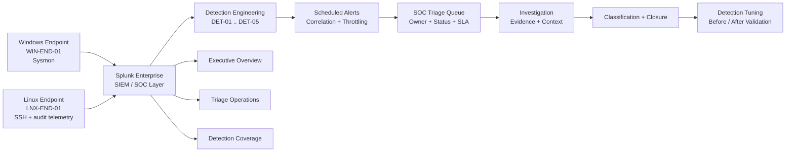

# Architecture

## End-to-end design



The lab is intentionally small enough to remain reproducible while still exercising the same sequence an analyst would follow in a production-style SOC workflow: ingest telemetry, detect, alert, triage, investigate, classify, close, and tune.

## Telemetry layer

### Windows endpoint — `WIN-END-01`

Windows security telemetry is indexed in `soc_sysmon`.

Primary evidence used in the project includes:

- Sysmon EventCode 1 — process creation
- Sysmon EventCode 3 — network connection context
- process image and command-line data
- parent process image / command line
- process GUID / PID relationships
- registry-oriented change data through the Splunk Change data model where available

This telemetry supports PowerShell, scheduled-task, registry persistence, process-lineage, and network-context analysis.

### Linux endpoint — `LNX-END-01`

Linux security telemetry is indexed in `soc_linux`.

Primary sources include:

- `linux_secure` SSH authentication events
- `auditd` telemetry for broader system context

The SSH dataset supports extraction of source IP, source port, target user, failed authentication events, successful authentication checks, and session-open validation.

## Detection layer

| Detection | Data source | Technique | Primary correlation context |
| --- | --- | --- | --- |
| DET-01 — Linux SSH Brute Force | Linux SSH auth logs | T1110.001 | `host + src_ip + target_user` |
| DET-02 — Suspicious PowerShell | Sysmon process creation | T1059.001 | `host + user + suspicious_reason` |
| DET-03 — Local Account Creation | CIM Change | T1136.001 | `host + changed object` |
| DET-04 — Scheduled Task Creation | Sysmon process creation | T1053.005 | `host + task_name` |
| DET-05 — Registry Run Key Persistence | CIM Change | T1547.001 | `host + registry path` |

Saved searches run on a recurring five-minute cadence and use correlation-key throttling where configured to reduce duplicate alerting.

## SOC case-management layer

Case state is persisted in a Splunk lookup with the following fields:

```text
case_id
rule_id
correlation_key
triage_status
triage_owner
triage_notes
created_at
last_update
```

The operational workflow uses `New`, `Investigating`, and `Closed` states. Closed cases are removed from the active queue but retained for historical reporting and closure-time metrics.

## Investigation layer

Two detections were taken through the full investigation lifecycle:

- **INC-01 / DET-02** — Base64 extraction, PowerShell payload decoding, process lineage, child-process review, related endpoint context, final Benign Positive classification.
- **INC-02 / DET-01** — SSH failure reconstruction, source/user correlation, successful-authentication check, session-open check, final True Positive classification.

The investigation results then fed directly back into tuning decisions.

## Dashboard layer

Three dashboards separate stakeholder needs:

- **SOC - Executive Overview** — case volume, priority, affected assets, ATT&CK coverage, status, trends, closure metrics.
- **SOC - Triage Operations** — active queue, SLA, analyst workload, suspicious activity, source volume, endpoint log health, Splunk WARN/ERROR visibility.
- **SOC - Detection Coverage** — detection catalog, ATT&CK mapping, data-source readiness, validation status, tuning maturity, investigation depth.

See [`../dashboards/dashboards.md`](../dashboards/dashboards.md) and the [`../screenshots/`](../screenshots/) evidence gallery.

## Design decisions demonstrated

1. **Correlation before escalation** — alerts group repeated activity into analyst-meaningful context rather than presenting raw events only.
2. **Evidence-backed tuning** — changes were accepted only after before/after testing showed what noise was removed and what attack coverage was preserved.
3. **Context over syntax** — suspicious PowerShell syntax was investigated through decoded payloads and process relationships before classification.
4. **Case-state consistency** — dashboard metrics use a consistent case population so active, closed, and total counts do not contradict one another.
5. **Data-quality visibility** — stale endpoint telemetry and incomplete enrichment are surfaced as operational findings rather than hidden.

## Security boundary

The repository contains only sanitized lab documentation and evidence. Authentication secrets, tokens, cookies, private keys, and unrelated personal information are intentionally excluded. Private RFC1918 lab addresses may appear where they are necessary to preserve investigation context.
