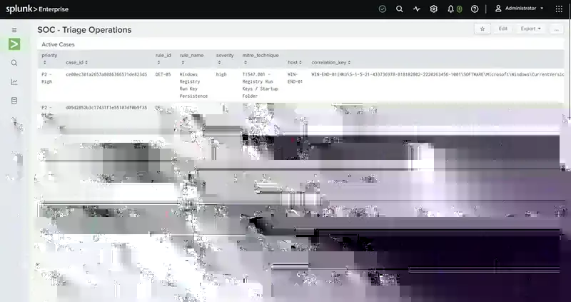

# Dashboards

## SOC - Executive Overview

Purpose: executive-level visibility into SOC case volume, current workload, affected assets, ATT&CK coverage, and investigation progress.

Key panels:

- Total Cases
- Active Cases
- Closed Cases
- Average Closure Time
- Cases by Priority
- Cases by Detection Rule
- Investigation Status
- Affected Assets
- Users / Accounts Involved
- Cases by MITRE ATT&CK Technique
- Case Trend Over Time

The dashboard demonstrates that detection results are translated into security-operations metrics rather than left as isolated search output.

## SOC - Triage Operations

Purpose: operational SOC view for active case management, SLA tracking, analyst workload, telemetry activity, and collection health.

Key panels:

- active case queue
- cases by priority
- cases by detection rule
- cases by analyst
- SLA status and breached cases
- closed-case history
- SSH authentication failures
- suspicious PowerShell processes
- Sysmon event activity
- Windows account changes
- suspicious process network connections
- endpoint log health
- event volume by source
- Splunk WARN/ERROR activity

The active queue combines detection context with case ID, owner, priority, SLA state and correlation key, which makes the dashboard usable for analyst workflow rather than passive visualization.

Operational findings discovered while building this dashboard included stale endpoint telemetry and incomplete CIM field enrichment for some Windows account-change data.

## SOC - Detection Coverage

Purpose: detection-engineering coverage and validation status.

Key panels:

- Implemented Detections
- MITRE ATT&CK Techniques Covered
- Detection Catalog
- Coverage by MITRE ATT&CK Technique
- Detection Data Source Readiness
- Validated Detection Tests
- Detection Tuning Status
- Case Classification Outcomes
- Fully Investigated Detection Rules
- Detection Validation Matrix

At the completed dashboard milestone, the lab contained 5 validated detections, 5 mapped ATT&CK techniques, 2 fully investigated rules, and 2 formally tuned rules.

## Why three dashboard layers

The dashboards were intentionally separated by audience and task:

- **Executive Overview** answers what is happening at a high level.
- **Triage Operations** supports the analyst who must work active cases and monitor telemetry health.
- **Detection Coverage** supports detection engineering by showing rule maturity, ATT&CK mapping, validation and data-source readiness.

This separation is intended to model how the same SIEM data can serve management reporting, day-to-day SOC operations and engineering review without forcing all use cases into one dashboard.

## Screenshot guidance

The curated gallery is maintained under [`../screenshots/`](../screenshots/). Screenshots are cropped and selected to demonstrate specific outcomes; credentials, tokens, cookies, private keys and unrelated personal information must not be published.
