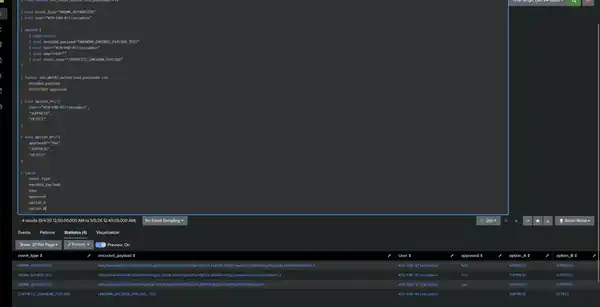

# Tuning Register

This report summarizes the two detections that completed formal before/after tuning. The emphasis is on measured changes and regression testing rather than tuning by intuition.

## DET-01 — Linux SSH Brute Force

### Before

The broad base search selected 81 events containing the text `Failed password for`. Three of those events were not SSH authentication failures; they were `sudo` commands running `grep 'Failed password for' /var/log/secure`.

### Threshold analysis

The observed data was tested against multiple candidate thresholds before the production-style saved search was changed.

- `>=5`: preserved 9 observed detection windows.
- `>=6`: lost one observed five-attempt window.
- `>=8`: would miss every observed window associated with INC-02.

### After

The rule was restricted to real `sshd` / `sshd-session` failure messages.

- Selected events before: 81
- Real SSH failures after filtering: 78
- Irrelevant events removed: 3
- Triggered windows before: 9
- Triggered windows after: 9
- INC-02 windows preserved: 4 of 4
- Threshold: retained at `>=5` failures
- Window: retained at 5 minutes

### Risk analysis

The safer engineering decision was to improve event quality instead of raising the threshold. This reduced irrelevant candidate events without reducing observed window coverage.

### Decision

**Tuning Approved.** Noise was removed without reducing observed detection-window coverage.

---

## DET-02 — Windows Suspicious PowerShell

### Before

Five PowerShell EncodedCommand executions generated detections. Investigation showed all five were authorized SIEM-lab activity, represented by three distinct Base64 payloads.

### Candidate strategies

1. Exclude the analyst account globally.
2. Allowlist only the exact payloads already validated as authorized.

### Regression test

A synthetic unknown-payload test demonstrated the security trade-off directly:

- **Option A — user exclusion:** would suppress the unknown payload because it was executed by `secadmin`.
- **Option B — exact-payload allowlist:** suppresses the known authorized payloads but still detects the unknown payload.

### After

- Historical suspicious executions before: 5
- Known authorized historical detections after: 0
- Authorized payloads allowlisted: 3
- Global user exclusion: rejected
- Unknown EncodedCommand payloads: remain detectable
- Other suspicious PowerShell behaviors: remain detectable

### Decision

**Tuning Approved.** Exact-payload allowlisting was selected because it suppresses only known authorized activity while preserving detection of new payloads.

## Current catalog status

- Total detections: 5
- Validated detections: 5
- Tuned detections: 2
- Not yet formally reviewed for tuning: 3

## Classification evidence used during tuning

- Confirmed True Positive investigated: 1
- Confirmed Benign Positive investigated: 1
- Confirmed False Positives: 0
- Historical closed case without recorded classification: 1

## Engineering takeaway

Both tuning exercises deliberately avoided the easiest way to reduce alerts. DET-01 kept its sensitivity and removed non-SSH input noise; DET-02 rejected a broad user exclusion and used a narrowly scoped allowlist. This is the central before/after lesson of the lab: **reduce known noise without discarding observable malicious behavior.**

All numbers above are lab-observed values and should not be interpreted as production performance claims.
